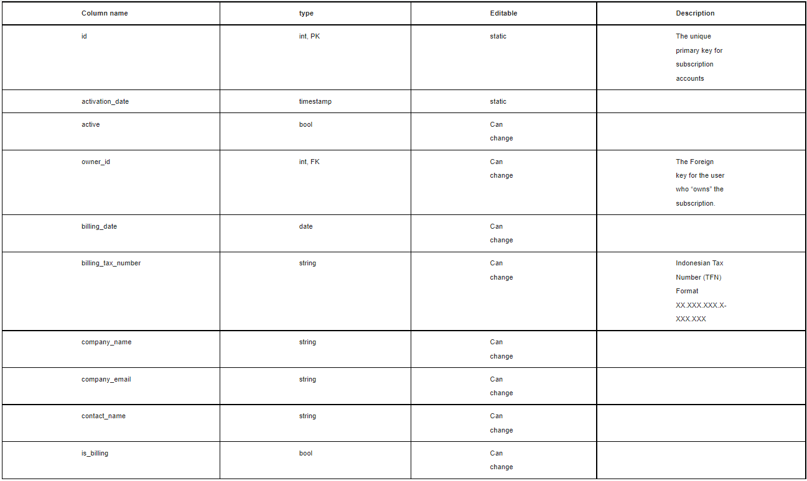
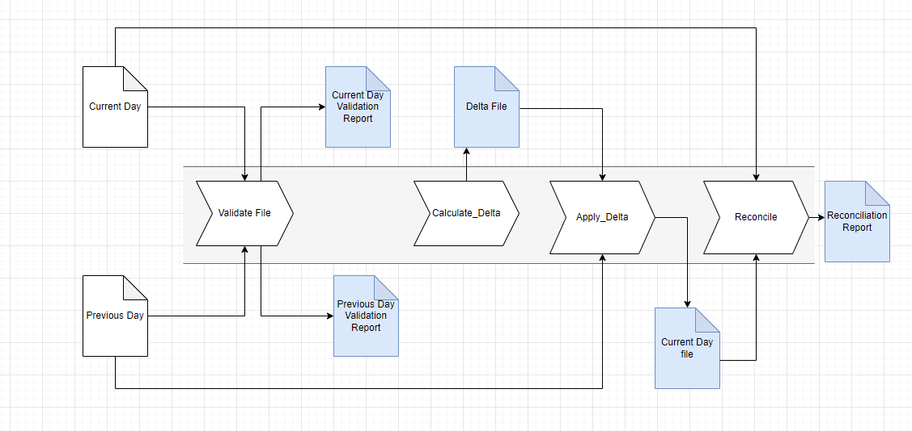

OP Ingestion-project
==============
***
## Requirements:

The scenario: there is a nightly job which extracts the `accounts` table from our subscriptions application. Each night a complete copy of the table is extracted into a parquet file.

Each row of the table corresponds to a subscription account, and is responsible for determining which user manages the subscription, and the main company/business entity who is paying for the subscription. There are other tables in this database which match subscription accounts to the actual subscription plans, payments, and user details; there is no need to address them in your solution.

We will provide two parquet files containing table snapshots from two consecutive days:
- 2021-10-25-dump.parquet
- 2021-10-26-dump.parquet

These will be representative of the type of snapshots we will be receiving.

**The challenge consists of two parts:**

1. Transform snapshots into data deltas, and pass those deltas upstream.
2. Testing data quality, implement testing on the datasets provided and comment on how results should be reported

**_Additional Context_**: Downstream this data will be aggregated into KPIs and dashboards for management and the subscription team. A product owner will review these metrics daily and report the KPIs weekly to management. 
The data:

### Data Dictionary:

### Part one:

**Write two functions:**

**calculate_delta**: this will take two table snapshots, and calculate the difference between them, including the row which have been deleted, inserted and updated. How you store this diff is left to you, but it will need to be used for the next step.

**apply_delta**: The second function should be able to apply the result of calculate_delta to the earlier snapshot, and return the second

These functions are analogous to the diff and patch command line tools from unix, applied to our datasets.

Also, Give a sketch of a design to integrate these functions into a data pipeline where you receive a new snapshot of a production database each day, and use the delta to update your staging tables. Give some commentary about the strengths and weaknesses of your solution, and offer some suggestions as to how the system or upstream data could be changed to improve the solution.

### Part Two:

- Write tests to verify the data quality of the datasets:
- Outline the method you have chosen for testing the data (at scheduled intervals or during ingress)
- Outline and implement the test cases for the dataset (hint: they should cover data formats and your understanding/assumptions of the business rules).
- From your understanding of the scenario, comment on how the data testing results should be reported.

***
## Assumptions:
- There is a separate process to get the KPI data from the delta output files.
- These delta files can be further normalized to capture more metrics.

# Weekness:
This pipeline is catering full load every time which is not very performant.

## Suggestions:
Upstream system can add "Create Datetime" and "Modified Datetime" as columns, which can be effectively utilised to filter the load  and run ingestion.

***
## Pipeline Schematic:

***

## Setup:
- Create a virtual environment for Python 3.9 or higher.
  - python -m venv venv
  - venv\scripts\activate
  - pip install -r requirements.txt

- To run unit test cases:
  - python -m pytest -rP test\test_op_ingestion.py

- To run the ingestion:
  - python src\op_ingestion.py

### Known bug/gaps:
- Reconciliation result is not showing correct output, Though data and schema is correct post applying delta to previous days data.
- while running the pipeline, file names can be taken as parameters, this is not implemented.
- To Monitor the pipeline, Overall execution time can be calculated and audited for each run.

## Python Library Reference:
- Cerebrus(For File validation) : https://docs.python-cerberus.org/en/stable/
